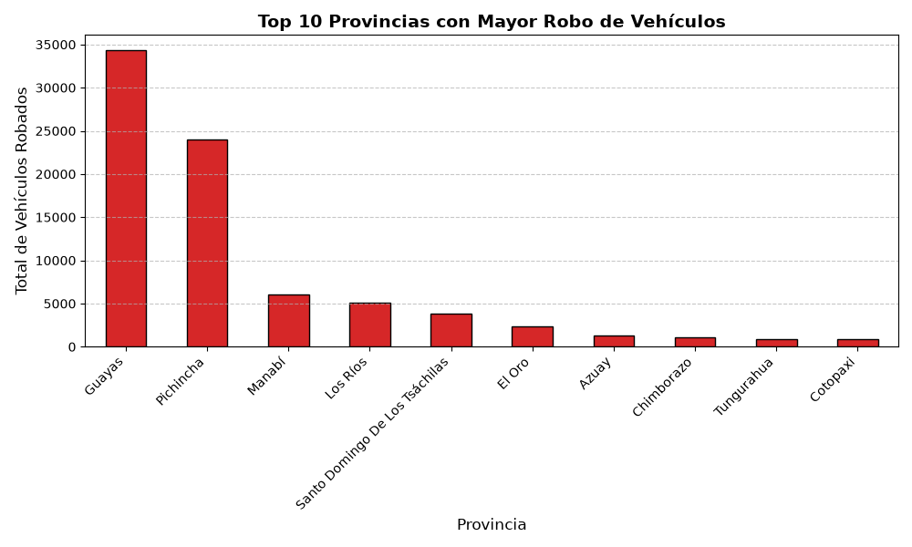
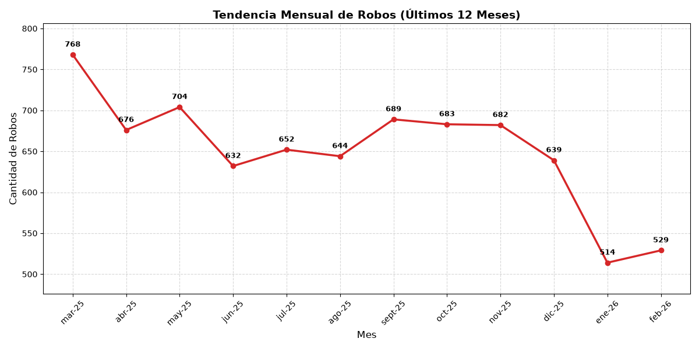
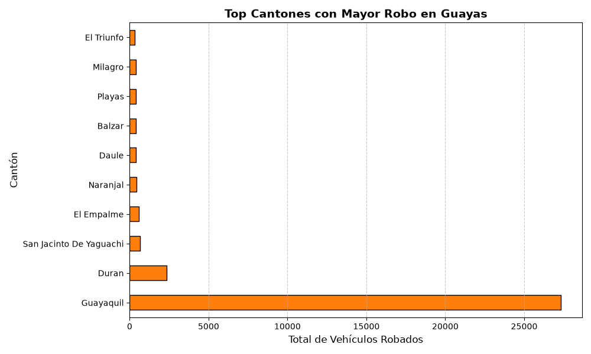

#+title: Dashboard de Robo de Vehículos
#+language: es

* Análisis de Robo de Vehículos en Ecuador
En esta sección se presenta un análisis exploratorio de los datos proporcionados por el INEC sobre el robo de vehículos a nivel nacional, aplicando herramientas de Data Science con Python.

** Carga de Datos
A continuación, importamos el dataset limpio y verificamos su estructura general:

#+begin_src python :session :results output :exports both
import pandas as pd

# Cargamos el archivo CSV (asegúrate de que el nombre coincida)
ruta_archivo = '../../robos-carros-inec.csv'
df_robos = pd.read_csv(ruta_archivo, sep=';')

# Imprimimos la cantidad de filas y columnas
print(f"Estructura del dataset (Filas, Columnas): {df_robos.shape}")
#+end_src

#+RESULTS:
: Estructura del dataset (Filas, Columnas): (222, 149)

** Top 10 Provincias con Mayor Índice de Robos
Para entender la distribución espacial del delito, agrupamos los datos por provincia y sumamos la cantidad de robos reportados en todos los meses del año.

#+begin_src python :session :results output :exports results
import matplotlib.pyplot as plt
import os

os.makedirs('./images', exist_ok=True)

columna_provincia = df_robos.columns[0]
df_robos = df_robos[~df_robos[columna_provincia].astype(str).str.contains('Total', case=False, na=False)]

columnas_meses = df_robos.columns[3:]
df_robos['Total_Anual'] = df_robos[columnas_meses].sum(axis=1)

robos_por_provincia = df_robos.groupby(columna_provincia)['Total_Anual'].sum()
top_10_provincias = robos_por_provincia.sort_values(ascending=False).head(10)

fig = plt.figure(figsize=(10, 6))
top_10_provincias.plot(kind='bar', color='tab:red', edgecolor='black')

plt.title('Top 10 Provincias con Mayor Robo de Vehículos', fontsize=14, fontweight='bold')
plt.xlabel('Provincia', fontsize=12)
plt.ylabel('Total de Vehículos Robados', fontsize=12)
plt.xticks(rotation=45, ha='right')
plt.grid(axis='y', linestyle='--', alpha=0.7)
fig.tight_layout()

plt.savefig('./images/robos_provincia.png')
#+end_src

#+RESULTS:

#+caption: Figura 1: Top 10 Provincias con mayor incidencia de robos vehiculares.

*Descripción:* Esta gráfica de barras clasifica las 10 provincias del Ecuador con mayor cantidad de vehículos robados. Permite identificar rápidamente las zonas geográficas que concentran el mayor riesgo, siendo un análisis fundamental para focalizar estrategias de seguridad a nivel nacional.

** Tendencia Temporal (Último Año Registrado)
Este análisis se centra en la tendencia mensual de los últimos 12 meses registrados para observar el comportamiento delictivo más reciente.

#+begin_src python :session :results output :exports results
import matplotlib.pyplot as plt
import matplotlib.ticker as ticker

columnas_limpias = [col for col in df_robos.columns[3:] if col != 'Total_Anual']
columnas_ultimo_anio = columnas_limpias[-12:]

total_mensual = df_robos[columnas_ultimo_anio].sum()

fig, ax = plt.subplots(figsize=(12, 6))
ax.plot(total_mensual.index, total_mensual.values, marker='o', color='tab:red', linestyle='-', linewidth=2.5)

min_val = total_mensual.min()
max_val = total_mensual.max()
rango = max_val - min_val

ax.set_ylim(min_val - (rango * 0.15), max_val + (rango * 0.15))
ax.get_yaxis().set_major_formatter(ticker.FuncFormatter(lambda x, p: format(int(x), ',')))

for i, txt in enumerate(total_mensual.values):
    ax.annotate(f"{int(txt):,}", 
                (total_mensual.index[i], total_mensual.values[i]),
                textcoords="offset points", 
                xytext=(0, 10), 
                ha='center', 
                fontsize=9, 
                fontweight='bold',
                color='black')

plt.title('Tendencia Mensual de Robos (Últimos 12 Meses)', fontsize=14, fontweight='bold')
plt.xlabel('Mes', fontsize=12)
plt.ylabel('Cantidad de Robos', fontsize=12)

plt.xticks(rotation=45)
plt.grid(True, linestyle='--', alpha=0.5)
fig.tight_layout()

plt.savefig('./images/robos_mensuales.png')
#+end_src

#+RESULTS:

#+caption: Figura 2: Evolución mensual de robos a nivel nacional (Últimos 12 meses).

*Descripción:* El gráfico de líneas ilustra la fluctuación temporal de los robos de vehículos mes a mes. Las etiquetas de datos sobre cada punto facilitan la detección de picos inusuales o reducciones sostenidas producto de factores estacionales.

** Análisis Crítico por Cantón
A nivel provincial, el delito suele concentrarse en los centros urbanos poblados. A continuación, se desglosa el total de robos en los cantones de la provincia más afectada.

#+begin_src python :session :results output :exports results
provincia_critica = top_10_provincias.index[0]

df_critica = df_robos[df_robos[columna_provincia] == provincia_critica]
columna_canton = df_robos.columns[2]

robos_por_canton = df_critica.groupby(columna_canton)['Total_Anual'].sum().sort_values(ascending=False).head(10)

fig = plt.figure(figsize=(10, 6))
robos_por_canton.plot(kind='barh', color='tab:orange', edgecolor='black')

plt.title(f'Top Cantones con Mayor Robo en {provincia_critica}', fontsize=14, fontweight='bold')
plt.xlabel('Total de Vehículos Robados', fontsize=12)
plt.ylabel('Cantón', fontsize=12)
plt.grid(axis='x', linestyle='--', alpha=0.7)
fig.tight_layout()

plt.savefig('./images/robos_canton.png')
#+end_src

#+RESULTS:

#+caption: Figura 3: Cantones más vulnerables dentro de la provincia crítica.

*Descripción:* Al enfocar el análisis en la provincia con el mayor índice de criminalidad vehicular, esta visualización revela en qué cantones específicos se centraliza el delito, evidenciando los núcleos urbanos con mayor incidencia delictiva.
** Publicación de Recursos Visuales
Para que las gráficas se muestren en la web, copiamos las imágenes generadas a la carpeta pública.

#+begin_src shell :results output :exports results
cp -rfv ./images/* ../public/images/
#+end_src

#+RESULTS:
: './images/humidity.png' -> '../public/images/humidity.png'
: './images/robos_canton.png' -> '../public/images/robos_canton.png'
: './images/robos_mensuales.png' -> '../public/images/robos_mensuales.png'
: './images/robos_provincia.png' -> '../public/images/robos_provincia.png'
: './images/temperature.png' -> '../public/images/temperature.png'

* Navegación del Proyecto
Para continuar navegando por el proyecto, utilice los siguientes enlaces:
- [[file:page2-js.org][<- Anterior: Calculadora de Multiplicación IEEE 754]]
- [[file:index.org][Volver al Inicio: Proyecto Clima API ->]]
