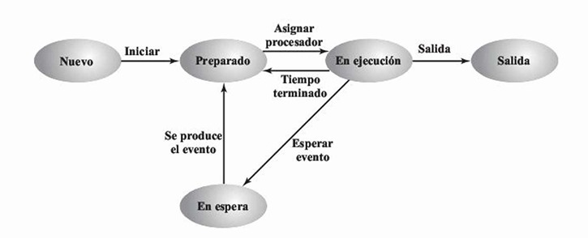
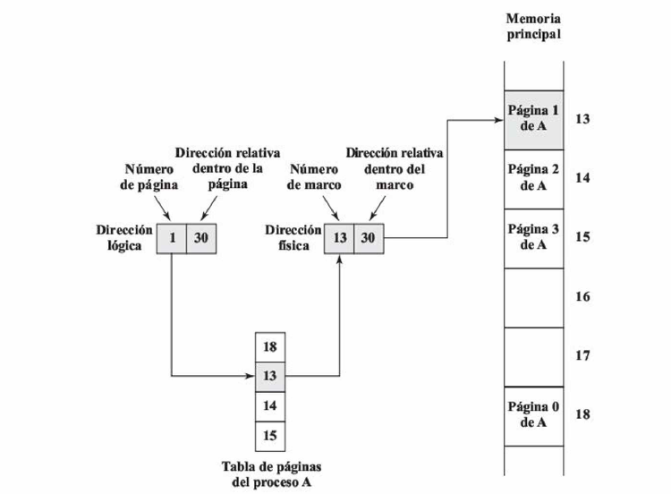
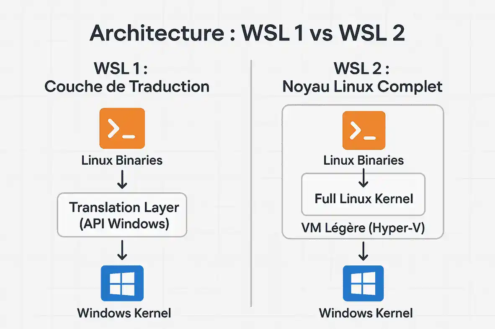

#+options: H:2
#+latex_class: beamer
#+columns: %45ITEM %10BEAMER_env(Env) %10BEAMER_act(Act) %4BEAMER_col(Col) %8BEAMER_opt(Opt)
#+beamer_theme: Madrid
#+beamer_color_theme:
#+beamer_font_theme:
#+beamer_inner_theme:
#+beamer_outer_theme:
#+beamer_header:

#+title: S12 — Soporte del SO: Memoria Virtual, Máquinas Virtuales y WSL
#+date: 
#+author: Grupo 9
#+email: leonardo.rodriguez01@epn.edu.ec
#+language: es
#+select_tags: export
#+exclude_tags: noexport
#+creator: Emacs 27.1 (Org mode 9.3)
#+cite_export: biblatex

#+bibliography: ./bibliography/bibliography.bib
#+LATEX_HEADER: \usepackage[T1]{fontenc}
#+LATEX_HEADER: \usepackage[utf8]{inputenc}
#+LATEX_HEADER: \usepackage[spanish]{babel}
#+LATEX_HEADER: \usepackage[backend=biber,citestyle=apa, style=apa]{biblatex}
#+LATEX_HEADER: \titlegraphic{\includegraphics[height=2cm]{images/logoEpn.jpg}}

* Soporte del Sistema Operativo (Sección)

** Objetivos del SO (G9, 11, 279)
- El sistema operativo (SO) es un programa que controla la ejecución
  de aplicaciones y actúa como interfaz entre el usuario y el
  hardware.
- *Comodidad:* Su primer objetivo es hacer que el computador sea más
  fácil y cómodo de usar para el usuario final.
- *Eficiencia:* Su segundo objetivo es administrar los recursos del
  sistema de forma eficiente para maximizar su aprovechamiento.
- Actúa como un mecanismo de control inusual: es un programa que cede
  el control del procesador a otras aplicaciones y luego lo recupera
  para seguir gestionando el sistema.

** Funciones del SO relacionadas con memoria (G9, 11, 279)
- Existe la  mono pogramacion que se basan en la ejecucion de
  un solo proceso hasta que este termine de ejecutarse. 
- La multiprogramacion en cambio trabaja con multiples procesos
  consecutivos asignandoles un espacio de memoria y tiempo especificos
  para terminar de ejecutarse.  
- *Intercambio (Swapping):* Para evitar que el procesador quede
  inactivo, el SO mueve temporalmente al disco los procesos que están
  en espera, liberando espacio en memoria principal para nuevos
  trabajos.
** Estados de un Proceso (Planificación)
#+attr_latex: :width 0.85\textwidth :center t

* Planificación y Memoria Virtual (Sección)

** Planificación de la memoria (G9, 11, 280)
- *Particionamiento:* Puede ser fijo (tamaños predefinidos) o dinámico
  (asignación exacta requerida). Ambos métodos generan espacios
  desperdiciados o fragmentación con el tiempo.
- *Paginación:* El SO divide la memoria en marcos de tamaño fijo y los
  procesos en páginas.
- *Segmentacion:* El SO divide la memoria en partes de tamaño variable
  y tambien los procesos en segmentos con diferentes tipos de
  funciones como las principales y las secundarias.

** Principios de Memoria Virtual (G9, 11, 282)
- Permite ejecutar un proceso sin cargar todas sus instrucciones y
  datos en la memoria principal de manera simultánea.
- *Paginación por demanda:* Las páginas se traen a la memoria solo
  cuando se solicitan explícitamente, aprovechando el principio de
  localidad.
- El programador percibe un espacio de memoria enorme (memoria virtual
  en disco) sin preocuparse por los límites de la memoria real
  (RAM).

** Paginación (G9, 11, 283)
*** Texto                                           :BMCOL:
:PROPERTIES:
:BEAMER_col: 0.5
:END:
- La memoria física se divide en trozos fijos llamados *marcos* (frames).
- Los procesos se dividen en *páginas* del mismo tamaño.
- La tabla de páginas mapea cada página virtual a su marco físico.
- Minimiza el desperdicio de memoria.

*** Imagen                                          :BMCOL:
:PROPERTIES:
:BEAMER_col: 0.5
:END:
#+attr_latex: :width 0.9\textwidth
[[file:images/figura_8_14.png]]
* Traducción de Direcciones (Sección)

** Traducción de direcciones virtuales a físicas (G9, 11, 285)
*** Texto                                           :BMCOL:
:PROPERTIES:
:BEAMER_col: 0.5
:END:
- La dirección lógica (virtual) consta de un número de página y un desplazamiento.
- La dirección física real consta de un número de marco y un desplazamiento.
- El procesador utiliza la tabla de páginas para producir la dirección física a partir de la lógica.

*** Imagen                                          :BMCOL:
:PROPERTIES:
:BEAMER_col: 0.5
:END:
#+attr_latex: :width \textwidth

** El Principio de Localidad
- Durante la ejecución, los programas confinan su actividad a una pequeña sección del programa o de los datos.
- Este comportamiento fundamental se conoce como el principio de localidad.
- Permite cargar solo unas pocas páginas en lugar del proceso entero, haciendo un uso más eficiente de la memoria principal.

** TLB (Translation Lookaside Buffer) (G9, 11, 287)
- Un esquema de memoria virtual directo duplica el tiempo de acceso a memoria, requiriendo un acceso a la tabla y otro al dato.
- Para superarlo, se usa un caché especial llamado buffer de traducción anticipada o TLB.
- El TLB almacena las entradas de la tabla de páginas usadas más recientemente.
- Debido al principio de localidad, la mayoría de las referencias a memoria encontrarán su traducción rápidamente en el TLB.

** Tabla de Páginas Invertida
*** Texto                                                           :BMCOL:
:PROPERTIES:
:BEAMER_col: 0.5
:END:
- Es una alternativa para sistemas con enormes espacios de direcciones virtuales.
- Utiliza una función de dispersión (hash) basada en el número de página virtual.
- Existe un único elemento en la tabla por cada marco de memoria física real, ahorrando espacio independientemente de los procesos.

*** Imagen                                                          :BMCOL:
:PROPERTIES:
:BEAMER_col: 0.5
:END:
#+attr_latex: :width \textwidth
[[file:images/traduccion_direcciones.png]]

** Page Faults y reemplazo de páginas (G9, 11, 290)
- Con la paginación por demanda, cada página se trae a memoria solo cuando se necesita.
- Si el procesador hace referencia a una página que no está en memoria principal, se produce un fallo de página (page fault).
- El SO indica al procesador que lea la página del disco y actualiza la tabla de páginas.

** Algoritmos de Reemplazo e Hiperpaginación
- Al traer una página nueva a una memoria llena, el SO debe reemplazar (sacar) otra página.
- Si se expulsa una página que se utilizará casi inmediatamente, el sistema gastará su tiempo intercambiando páginas en lugar de ejecutar código.
- Esta condición crítica se conoce como hiperpaginación o thrashing.
- Se busca evitar esto con algoritmos predictivos como el de "menos recientemente usada" (LRU).

** Ventajas de la Segmentación
- Como ya mencionamos, divide la memoria en espacios dinámicos, pero su gran diferencia es que este esquema suele ser visible para el programador.
- Simplifica el manejo de estructuras de datos que crecen o se encogen dinámicamente.
- Facilita la compartición de código y utilidades entre diferentes procesos de forma segura.
- Permite asignar de manera más natural los privilegios y atributos de protección a cada bloque de memoria.

** Segmentación + Paginación (Caso x86/Pentium)
- Procesadores como el Intel x86 combinan las ventajas de ambos métodos.
- El mecanismo de segmentación mapea una dirección virtual a una dirección lineal.
- Posteriormente, el mecanismo de paginación traduce esa dirección lineal a una dirección física real.
- El SO gestiona la asignación física de esas páginas en marcos de memoria.

** Protección de Memoria y Niveles de Privilegio
- El hardware asocia niveles de privilegio y atributos de acceso a cada segmento o página.
- Existen 4 niveles de privilegio, desde el más protegido (Nivel 0) para control de memoria, hasta el menos protegido (Nivel 3) para aplicaciones.
- Los atributos especifican permisos como solo lectura o lectura/escritura.
- Si un programa intenta un acceso no autorizado, el hardware detecta el error y transfiere el control al sistema operativo.

* Máquinas Virtuales (Sección)

** ¿Qué es una Máquina Virtual? (G9, 11, 292)

- Una Máquina Virtual (VM) es un software que simula un computador
  completo.
- Permite ejecutar varios sistemas operativos sobre un mismo hardware físico.
- Cada sistema operativo invitado cree que posee CPU, memoria y disco propios.
- El aislamiento permite que cada VM funcione independientemente de las demás.

** ¿Por qué utilizar Máquinas Virtuales?

- Ejecutar varios sistemas operativos simultáneamente.
- Aprovechar mejor el hardware disponible.
- Probar software sin afectar el sistema principal.
- Crear laboratorios y entornos de desarrollo.
- Ejecutar aplicaciones antiguas o incompatibles.

** Host OS y Guest OS (G9, 11, 292)

*** Host OS                                                           :BMCOL:
:PROPERTIES:
:BEAMER_env: block
:END:

- Sistema operativo instalado físicamente.
- Administra el hardware real.
- Controla CPU, memoria, disco y dispositivos.

*** Guest OS                                                          :BMCOL:
:PROPERTIES:
:BEAMER_env: block
:END:

- Sistema operativo que se ejecuta dentro de una VM.
- Cree tener acceso exclusivo al hardware.
- Comparte recursos mediante el hipervisor.

** Hipervisor: ¿Qué hace?
- Es el software encargado de crear y administrar máquinas virtuales.
- Distribuye CPU, memoria, almacenamiento y red.
- Aísla las máquinas virtuales entre sí.
- Permite ejecutar múltiples Guest OS simultáneamente.

** Hipervisores: Tipo 1 y Tipo 2 (G9, 11, 295)

*** Texto                                                             :BMCOL:
:PROPERTIES:
:BEAMER_col: 0.45
:END:

- *Tipo 1 (Bare Metal):*
- Se instala directamente sobre el hardware.
- Mayor rendimiento.
- Uso común en centros de datos.

- *Tipo 2 (Hosted):*
- Funciona como una aplicación sobre un sistema operativo.
- Fácil de instalar.
- Ideal para estudiantes y pruebas.

*** Imagen                                                            :BMCOL:
:PROPERTIES:
:BEAMER_col: 0.55
:END:

#+attr_latex: :width \textwidth
file:images/hipervisores.png

** Comparación entre Tipo 1 y Tipo 2
| Tipo 1                 | Tipo 2                         |
|------------------------+--------------------------------|
| Directo sobre hardware | Sobre un SO anfitrión          |
| Máximo rendimiento     | Rendimiento ligeramente menor  |
| Empresas y servidores  | Uso personal y educativo       |
| ESXi, Hyper-V          | VirtualBox, VMware Workstation |

** Virtualización de Memoria (G9, 11, 298)

- El Guest OS utiliza direcciones virtuales.
- Estas se convierten en direcciones físicas virtuales.
- El hipervisor las traduce a direcciones físicas reales.
- Este proceso permite compartir la memoria de forma segura.

** Aceleración por Hardware

- La traducción de memoria puede ser costosa.
- Los procesadores modernos incorporan soporte para virtualización.
- Intel utiliza Extended Page Tables (EPT).
- AMD incorpora tecnologías equivalentes mediante AMD-V.
- Estas tecnologías reducen la sobrecarga y mejoran el rendimiento.

** WSL y su relación con las Máquinas Virtuales

- WSL permite ejecutar Linux dentro de Windows.
- WSL 1 no utiliza una máquina virtual.
- WSL 2 ejecuta un kernel real de Linux mediante una VM ligera.
- Utiliza Hyper-V como tecnología de virtualización.

* WSL como caso de estudio (Sección)

** Windows Subsystem for Linux (WSL) (G9, 11, 301)
- WSL es una característica de Windows que permite a los desarrolladores ejecutar un entorno GNU/Linux (herramientas CLI, utilidades y aplicaciones) de forma nativa.
- Evita el sobrecoste de recursos y los tiempos de arranque lentos asociados a una máquina virtual tradicional completa.
- Facilita el desarrollo cruzado sin necesidad de reiniciar la computadora (dual-boot).

** WSL1 vs WSL2: arquitectura (G9, 11, 303)
*** Texto                                           :BMCOL:
:PROPERTIES:
:BEAMER_col: 0.4
:END:
- *WSL1:* Capa de traducción de llamadas al sistema (Linux a NT). No hay kernel real.
- *WSL2:* Máquina virtual ligera altamente optimizada.
- Ejecuta un kernel de Linux completo mejorando el rendimiento de E/S.

*** Imagen                                          :BMCOL:
:PROPERTIES:
:BEAMER_col: 0.6
:END:
#+attr_latex: :width \textwidth

** Integración con el sistema de archivos Windows (G9, 11, 305)
- WSL permite acceder a los discos de Windows (C:, D:) desde Linux montándolos automáticamente en el directorio =/mnt/=.
- WSL2 utiliza un disco duro virtual (VHD) con formato nativo =ext4= para el sistema de archivos raíz de Linux.
- El acceso y la transferencia de archivos cruzada entre ambos sistemas operativos se realiza mediante el protocolo de red 9P.

** WSL y memoria virtual (G9, 11, 307)
- A diferencia de las VMs de Tipo 2 tradicionales que reservan y
  bloquean un fragmento estático de RAM, la VM de WSL2 asigna y libera
  memoria dinámicamente según la demanda.
- Si Linux libera memoria de su caché interna, WSL2 se encarga de
  devolver esa memoria RAM física al Host (Windows) para que otras
  aplicaciones de escritorio puedan utilizarla.
* Referencias
** Bibliografía
:PROPERTIES:
:BEAMER_opt: allowframebreaks
:END:

#+print_bibliography:

* Indicaciones
** Indicaciones
:PROPERTIES:
:BEAMER_opt: allowframebreaks
:END:
- Recuerde que si ~options: H:2~, entonces:
  - ~*~ Declara el nombre de la Sección
  - ~**~ Declara el nombre de la diapositiva
- Puede alterar la estructura de la diapositiva si lo considera necesario
- Para este tema consulte las siguientes fuentes:
  - \textcite{stallings2022computer}, 11ava edición, 2022, English,
    capítulo 8: Operating System Support, páginas 279 a 314.
  - \textcite{stallings2006esp}, 7ma edición, 2006, Español,
    capítulo 8: Soporte del Sistema Operativo.
- El grupo G9 expone este tema.
- El grupo expone el tema y sube la presentación (~.ORG~ y ~.PDF~ para Beamer, o ~.ORG~ y ~.HTML~ para reveal.js)
- El grupo sube las ayudas memoria/notas del tema usando la plantilla [[file:FormatoTareas/TemplateNotasClase.org]] (~.ORG~ y ~.PDF~)
