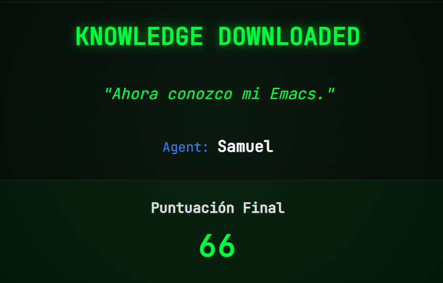

#+options: ':nil *:t -:t ::t <:t H:3 \n:nil ^:t arch:headline
#+options: author:t broken-links:nil c:nil creator:nil
#+options: d:(not "LOGBOOK") date:t e:t email:nil expand-links:t f:t
#+options: inline:t num:t p:nil pri:nil prop:nil stat:t tags:t
#+options: tasks:t tex:t timestamp:t title:t toc:nil todo:t |:t
#+title: Taller de Configuracion de Entorno WSL
#+date: 2026-04-08
#+author:Leonardo Rodriguez, Jóse Jacome,Samuel Churaco, 
#+email: leonardo.rodriguez01@epn.edu.ec, 
 #+language: Espanol
 #+select_tags: export
 #+exclude_tags: noexport
 #+creator: Emacs 27.1 (Org mode 9.7.5)
 #+cite_export:

 #+latex_class: article
 #+latex_class_options:
 #+latex_header:
 #+latex_header_extra:
#+description:
#+keywords:
#+subtitle:
#+latex_footnote_command: \footnote{%s%s}
#+latex_engraved_theme:
#+latex_compiler: pdflatex

#+latex_header: \usepackage{fancyhdr}
#+latex_header: \usepackage[top=25mm, left=25mm, right=25mm]{geometry}
#+latex_header: \usepackage{longtable}
#+latex_header: \fancyhead[R]{}
#+latex_header: \setlength\headheight{43.0pt}
#+LATEX_HEADER: \usepackage{tabularx}
#+LATEX_HEADER: \usepackage{longtable}

#+begin_export latex
\fancyhead[C]{\includegraphics[scale=0.05]{../images/logoEPN.jpg}\\
orESCUELA POLITECNICA NACIONAL\\FACULTAD DE INGENIERIA DE SISTEMAS\\
ARQUITECTURA DE COMPUTADORES}
\thispagestyle{fancy}
#+end_export

* Objetivos

- Configurar y validar el entorno de trabajo para la asignatura de Arquitectura de Computadores en Linux o WSL.
- Verificar la instalacion de herramientas base: mamba/anaconda (Python), Emacs y \LaTeX.
- Documentar evidencias tecnicas mediante capturas y comandos ejecutados.

* Instrucciones

1. Realice todas las actividades en Linux o en WSL.
2. En cada sección ejecute los comandos solicitados y registre la salida en el bloque correspondiente.
3. Guarde el archivo y exporte a pdf con el comando `org-latex-export-to-pdf`.
4. Verifique que estén todos los nombres de los integrantes del grupo
   de trabajo. Los grupos para este trabajo están en [[https://epnecuador.sharepoint.com/:x:/s/ICCD332-ArquitecturaComputadores/IQCjNuELSDbJTb42EfrLL2ksATBSbitbZ9_iFLJxIiCtSr0?e=gowv5I][Equipos de Trabajo]].
5. Verifique que en las distintas secciones de este archivo esté
   identificado con nombre e email el aporte del estudiante.

Si require insertar una imagen, crear una carpeta ~images~ y colocar
la imagen dentro. Para llamar la imagen desde Emacs use ~C-c C-l~ y
busque el archivo o escriba:Puede insertar una imagen con la sintaxis:

#+begin_src org
[[./images/image1.jpg]]
#+end_src
* Actividades
** Configuración de WSL con Ubuntu, \LaTeX, Python e Emacs

1. Verificacion de entorno mamba/anaconda
   1. Active WSL (si aplica) y su entorno de trabajo.
   2. Ejecute ~mamba info~ con ~C-c C-c~ dentro del bloque de código.
   3. Si el comando falla, active un entorno con ~mamba activate iccd332~ e intente de nuevo.
   
   #+begin_src shell :exports both :results verbatim
     mamba info
   #+end_src
  
   #+RESULTS:
   #+begin_example

	  libmamba version : 2.5.0
	     mamba version : 2.5.0
	      curl version : libcurl/8.19.0 OpenSSL/3.6.1 zlib/1.3.2 zstd/1.5.7 libssh2/1.11.1 nghttp2/1.68.1 mit-krb5/1.22.2
	libarchive version : libarchive 3.8.6 zlib/1.3.2 liblzma/5.8.2 bz2lib/1.0.8 liblz4/1.10.0 libzstd/1.5.7 liblzo2/2.10 openssl/3.5.5 libb2/bundled
	  envs directories : /home/samuchura-epn/miniforge3/envs
	     package cache : /home/samuchura-epn/miniforge3/pkgs
			     /home/samuchura-epn/.mamba/pkgs
	       environment : iccd332 (active)
	      env location : /home/samuchura-epn/miniforge3/envs/iccd332
	 user config files : /home/samuchura-epn/.mambarc
    populated config files : /home/samuchura-epn/miniforge3/.condarc
	  virtual packages : __unix=0=0
			     __linux=6.6.87=0
			     __glibc=2.39=0
			     __archspec=1=x86_64_v3
		  channels : https://conda.anaconda.org/conda-forge/linux-64
			     https://conda.anaconda.org/conda-forge/noarch
	  base environment : /home/samuchura-epn/miniforge3
		  platform : linux-64
   #+end_example
   -Leonardo Rodriguez
  [[[[file:~/imagenes/MambaEvidencia.jpeg]]]]

  #+end_example
  -Samuel Churaco
  [[[[file:Imgess/infoMamba.png]]]]
   
2. Verificacion de Python
   1. Active el entorno ~iccd332~ para abrir Emacs con ~mamba activate iccd332~.
   2. Ejecute ~python --version~ en la consola y desde Emacs.

   #+begin_src shell :exports both :results verbatimfg

    python --version
   #+end_src

   #+RESULTS:
   -Leonardo Rodriguez
  [[[[file:~/imagenes/PythonEvidencia.jpeg]]]]
  -Samuel Churaco
  [[[[file:Imgess/infoMamba.png]]]]   

3. Verificacion de Emacs
   Ejecute ~emacs --version~ en la consola y desde Emacs.

   #+begin_src shell :exports both :results verbatim
   emacs --version
   #+end_src

   #+RESULTS:
   -Leonardo Rodriguez
  [[[[file:~/imagenes/EmacsEvidencia.jpeg]]]]
  -Samuel Churaco
  [[[[file:Imgess/Emacsinf.png]]]]
4. Verificacion de LaTeX
   Ejecute ~latex --version~ en la consola y desde Emacs.

   #+begin_src shell :exports both :results verbatim
   latex --version
   #+end_src

   #+RESULTS:
   -Leonardo Rodriguez
  [[[[file:~/imagenes/LatexEvidencia.jpeg]]]]
   -Samuel Churaco
   [[[[file:Imgess/Latexinf.png]]]]
5. Registro de problemas y solucion aplicada

Complete la siguiente tabla si tuvo errores durante la configuracion:

#+ATTR_LATEX: :environment tabularx :width \textwidth :align lXX
| *Herramienta* | *Problema observado* | *Solucion aplicada* |
|---------------+----------------------+---------------------|
|               |                      |                     |
|               |                      |                     |
|               |                      |                     |
|               |                      |                     |
|               |                      |                     |
|               |                      |                     |
|               |                      |                     |
|               |                      |                     |

** Comandos Emacs Tutorial
Seguir el tutorial integrado en Emacs al respecto de la navegación y
operaciones más frecuentes. El tutorial puede ser accedido en Español
utilizando el comando:

#+begin_src emacs-lisp
M-x help-with-tutorial-spec-language
#+end_src

Realice los ejercicios del tutorial (al menos un 80% del texto) y
complete la siguiente tabla con los comandos que considere de mayor
interés. Verifique que en la parte superior se active el menú de
tabla. Dentro de la región de la tabla puede dar C-c C-c para alinear
automáticamente la tabla al contenido del texto que escriba. Para
generar una nueva fila escriba presione la tecla TAB

<Leonardo Rodriguez>
#+ATTR_LATEX: :environment longtable :align |p{0.2\linewidth}|p{0.3\linewidth}|p{0.2\linewidth}|p{0.3\linewidth}|
| *Comando* | *Descripción*                                                                   | *Comando* | *Descripción*                       |
|-----------+---------------------------------------------------------------------------------+-----------+-------------------------------------|
| - C-SPC   | - Seleccionar todo lo que necesites ya sea copiar o eliminar                    | - C-w     | - Cortar lo que tengas seleccionado |
|-----------+---------------------------------------------------------------------------------+-----------+-------------------------------------|
| - C-/     | - Comando para deshacer todo lo que hayas escrito como un control z tradicional | - C-k     | - Eliminar toda una linea           |
|-----------+---------------------------------------------------------------------------------+-----------+-------------------------------------|
| - C-s     | - Busqueda de pala hacia adelante                                               | - C-r     | - Busqueda de palabras hacia atras  |
|-----------+---------------------------------------------------------------------------------+-----------+-------------------------------------|

<Samuel Churaco>
#+ATTR_LATEX: :environment longtable :align |p{0.2\linewidth}|p{0.3\linewidth}|p{0.2\linewidth}|p{0.3\linewidth}|
| *Comando* | *Descripción*          | *Comando* | *Descripción*                         |
|-----------+------------------------+-----------+---------------------------------------|
| - C-h - 0 | Saltar entre ventadnas | C-x C-s   | Guarda cambios                        |
| - C-/  /  | Deshacer               | -C-g      | Elimina la intencion de algun comando |
| - C-d     | Elimina al otrollado   | C-v       | saltos de parrafo                     |
<Estudiante C>
#+ATTR_LATEX: :environment longtable :align |p{0.2\linewidth}|p{0.3\linewidth}|p{0.2\linewidth}|p{0.3\linewidth}|
| *Comando*         | *Descripción*               | *Comando* | *Descripción*                     |
|-------------------+-----------------------------+-----------+-----------------------------------|
| ~C-c C-e # latex~ | Insertar template de  latex | ~C-x C-s~ | Guardar los cambios en el archivo |
|                   |                             |           |                                   |
|                   |                             |           |                                   |

<Estudiante D>
#+ATTR_LATEX: :environment longtable :align |p{0.2\linewidth}|p{0.3\linewidth}|p{0.2\linewidth}|p{0.3\linewidth}|
| *Comando*         | *Descripción*               | *Comando* | *Descripción*                     |
|-------------------+-----------------------------+-----------+-----------------------------------|
| ~C-c C-e # latex~ | Insertar template de  latex | ~C-x C-s~ | Guardar los cambios en el archivo |
|                   |                             |           |                                   |
|                   |                             |           |                                   |
** Comandos Emacs Juego
En la anterior sección usted revisó los comandos de mayor interés
sobre la manipulación de Emacs. Es hora de poner en práctica sus
conocimientos. Realice unas 3 visitas al juego  [[https://chat.qwen.ai/s/deploy/t_23ff57ef-b59a-4bd7-9b79-54679b33686d][Emacs-Trainer]] y apunte
en la siguiente tabla su puntaje.

Estudiante A:Leonardo Rodriguez
|-----------+---------|
| iteración | Puntaje |
|-----------+---------|
|         1 |   128   |
|         2 |   140   |
|         3 |   135   |
|-----------+---------|

#+begin_src org
-Intento 1
[[file:~/imagenes/Intento1.jpeg]]
-Intento2
[[file:~/imagenes/Intento2.jpeg]]
-Intento3
[[file:~/imagenes/Intento3.jpeg]]

#+end_src

[[./EmacsTrainerResult.png]]

SamuelChuraco 
|-----------+---------|
| iteración | Puntaje |
|-----------+---------|
|         1 |      66 |
|         2 |     102 |
|         3 |     120 |
|           |         |
|-----------+---------|

#+begin_src org

#+end_src

Estudiante C: 
|-----------+---------|
| iteración | Puntaje |
|-----------+---------|
|         1 |         |
|         2 |         |
|         3 |         |
|-----------+---------|

#+begin_src org
[[./estudianteC-game.png]]
#+end_src

Estudiante D: 
|-----------+---------|
| iteración | Puntaje |
|-----------+---------|
|         1 |         |
|         2 |         |
|         3 |         |
|-----------+---------|

#+begin_src org
[[./estudianteD-game.png]]
#+end_src
** Usando Emacs para tener Ayuda sobre Emacs
¿Qué comandos le resultan más fáciles de usar y cuáles le son más
extraños? Identifique 4 comandos que le sean fáciles y 4 que le
resulten complicados. Revise qué dice la ayuda de Emacs sobre cada
comando y escriba en sus palabras el para qué sirve.

Para consultar lo que hace un comando ejecute:
1. ~C-h k~
2. Emacs le preguntara cuál es la combinación de la que requiere
   ayuda. Presione las teclas del comando. Por ejemplo, ~C-x C-f~
3. Emacs abrirá un nuevo buffer con la descripción del comando.
4. Cambie al buffer de la ayuda con ~C-x o~
5. Seleccione el primer parrafo de ayuda ubicando el cursor al inicio
   del parrafo y activando la marcación de texto con
   ~C-SPC~. Seleccione avanzando por palabras ~M-f~ o directamente
   toda la linea ~C-e~
6. Una vez seleccionado, copie el texto con ~M-w~.
7. Regrese al buffer anterior con ~C-x o~.
8. Pegue el texto en <Pegar lo que dice el...> con ~C-y~

**Comandos Fáciles**
1. **Leonardo Rodriguez:** <C-x C-f>. <Edit file FILENAME.
Switch to a buffer visiting file FILENAME, creating one if none
already exists.
Interactively, the default if you just type RET is the current directory,
but the visited file name is available through the minibuffer history:
type M-n to pull it into the minibuffer.
>
2. **Samuel Churaco**<C-x - o >. <
Select another window in cyclic ordering of windows.
COUNT specifies the number of windows to skip, starting with the
selected window, before making the selection.  If COUNT is
positive, skip COUNT windows forwards.  If COUNT is negative,
skip -COUNT windows backwards.  COUNT zero means do not skip any
window, so select the selected window.  In an interactive call,
COUNT is the numeric prefix argument.  Return nil.
 >
3. 
4. 

**Comandos Difíciles**
1. **Leonardo Rodriguez:** <C-s>. <It is bound to C-s.
It can also be invoked from the menu: Edit → Incremental Search →
Forward String...>
2. **Samuel Churaco:** <C-x -d>. <"Edit" directory DIRNAME--delete, rename, print, etc. some files in it.
Optional second argument SWITCHES specifies the options to be used
when invoking ‘insert-directory-program’, usually ‘ls’, which produces
the listing of the directory files and their attributes.
Interactively, a prefix argument will cause the command to prompt
for SWITCHES.
>
3.

* Equipo de Trabajo
Complete la información de los integrantes de grupo e indique el líder
de grupo.

|--------------------+---------------------------------+-------------|
| Nombre             | email                           | Rol         |
|--------------------+---------------------------------+-------------|
| Leonardo Rodriguez | leonardo.rodriguez01@epn.edu.ec | Líder       |
| Samuelchuraco      | samuelchuraco@epn.edu.ec        | Colaborador |
|                    |                                 | Colaborador |
|--------------------+---------------------------------+-------------|

* Verificación de Entregables [100%]:
Ejecute ~C-c C-c~ sobre los ítems de tarea según se hayan cumplido o
no. Si un ítem no pudo realizarse apunte en la siguiente sección las
razones al respecto.
- [X] Verificación de configuración de entorno WSL y paquetes del curso. 
- [X] Tutorial de Comandos Emacs realizado.
- [X] Captura de Imágenes y puntajes de Emacs Trainer App.
- [X] Usando Emacs para tener ayuda sobre Emacs
- [X] Verifique que estén los nombres de los integrantes del equipo e
  identificado el líder.
- [X] Revisión de ortografía con ~ispell~ en el buffer
- [X] Generación de Archivo PDF ~M-x org-latex-export-to-pdf~
** Problemas con la Tarea:
- Tarea $X_1$ no pudo completarse debido a
- Tarea $X_2$ no pudo completarse debido a
